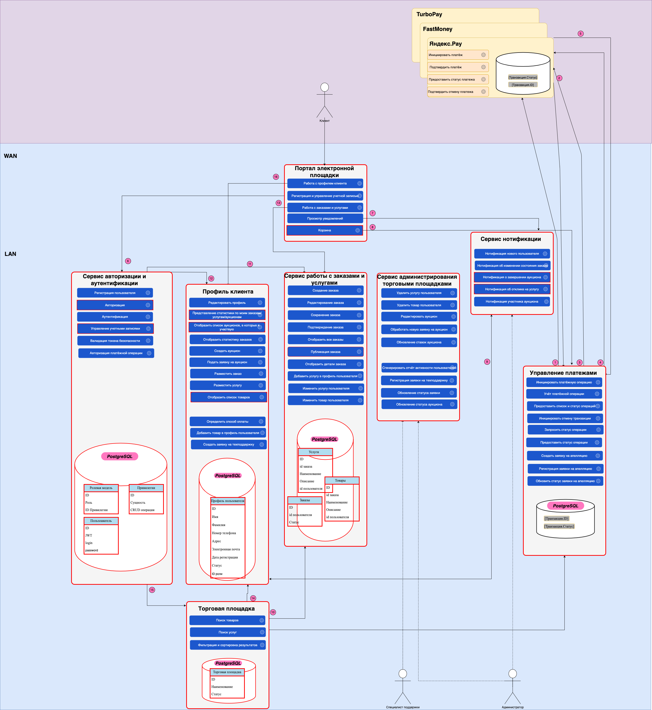

# Задание 1

## Уровень 1. Проектирование

Анализ существующего проекта позволяет сделать вывод о том, что он достаточно небольшой, и мы могли бы отказаться от разбиения на микрофронтенды. Однако, анализ предметной области показывает возможность расширения проекта и востребованность функционала работы с изображениями в принципе. 

Выберем для проектирования Single SPA, так как он позволит нам при расширении функциональности сайта использовать разные фреймворки, в том числе перспективные. Кроме того, при помощи import map мы сможем избежать дублирования зависимостей. 

## Уровень 2. Планирование изменений

Выделим микрофронтенды:
- аутентификации, авторизации и регистрации (auth)
- модуль работы с голосами (vote, куда вынесем часть функций по работе с лайками из компонента card.js)
- профиль пользователя (profile)
- работа с изображениями (images) - компонент работы с изображениями (редактирование/удаление/создание)
- модуль функционала со страницей (mainPage)

### Структура проекта

```jsx
/microfrontend
    /auth      
        /src
            /components
                InfoTooltip.js
                Login.js
                ProtectedRoute.js
                Register.js
            /blocks
                auth-form
                login
            /images
            /utils
                auth.js
            index.js
        package.json
        webpack.config.js
    /vote
        /src
            /components
                Card.js
                    handleLikeClick()
                    часть функционала, связанная с обработкой голосов
                App.js
                    handleCardLike()
            /blocks
                card.css
                    like-button
                    like-count
            /images
            /utils
                api.js
                    changeLikeCardStatus()
            index.js
        package.json
        webpack.config.js 
    /profile
         /src
            /components
                EditAvatarPopup.js
                EditProfilePopup.js
                App.js
                    handleEditProfileClick()
                    handleEditAvatarClick()
                    handleUpdateUser()
                    handleUpdateAvatar()
            /blocks
                profile                    
            /images
            /utils
                api.js
                    setUserAvatar()
                    getUserInfo()
                    setUserInfo()
            /contexts
            index.js
        package.json
        webpack.config.js 
    /images
         /src
            /components
                AddPlacePopup.js
                Card.js
                ImagePopup.js
            /blocks
                places
                card
            /images
            /utils
                api.js
                    removeCard()
                    addCard()
                    getCardList()
            /contexts
            index.js
        package.json
        webpack.config.js 
    /mainPage
         /src
            /components
                PopupWithForm.js
                App.js (оставшаяся часть)
                Footer.js
                Header.js
                Main.js
            /blocks
                content
                footer
                header
                page
                popup
            /images
                add-icon.svg
                close.svg
                delete-icon.svg
                edit-icon.svg
                error-icon.svg
                logo.svg
                success-icon.svg
                like-active.svg
                like-inactive.svg
            /utils
                api.js
                    getAppInfo()
            /contexts
                CurrentUserContext.js
            index.js
        package.json
        webpack.config.js 
```

## Уровень 3. Запуск готового кода

Выполнение отложено на более поздний срок, если останется время.

# Задание 2



## Микросервисы

Сервис авторизации и аутентификации - пояснения излишни
Профиль клиента - сервис по работе с профилем клиента, построением отчетов активности и просмотре истории 
Сервис работы с заказами и услугами - отдельный сервис для работы с заказами и услугами со стороны клиента
Торговая площадка - точка входа клиента в систему
Сервис администрирования торговыми площадками - выделенный сервис для совершения операций пользователям с расширенными правами
Сервис нотификации - пояснения излишни
Управление платежами - пояснения излишни

## Описание взаимодействий

1. Инициировать платёж — торговая площадка инициирует платёж, отправив необходимые данные (ID пользователя, ID заказа, сумма заказа) в платёжный сервис.

2. Предоставить статус платежа — платёжный сервис принял запрос на проведение оплаты, подтвердил возможность проведения платежа со счёта клиента, назначил идентификатор для этой транзакции и установил статус.

3. Подтверждение платежа — торговая площадка уведомляет платёжный сервис о подтверждении операции, отправляя ID транзакции.

4. Запросить статус платежа — торговая площадка отправляет запрос в платёжный сервис для получения текущего статуса обработки транзакции по ID.

5. Подтверждение отмены платежа (альтернативный сценарий) — платёжный сервис уведомляет систему об успешной отмене платежа, предоставляя статус отменённой транзакции.
